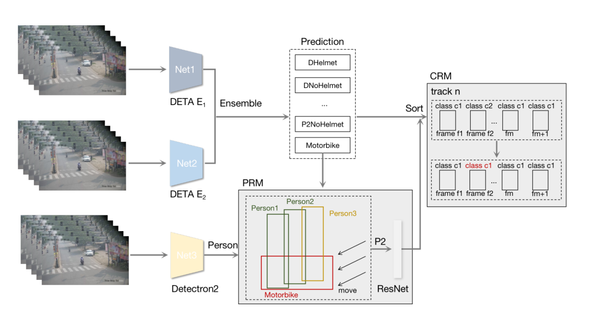

# AICITY2023_Track5
This repo includes solution for AICity2022 Challenge Track 5 - Detecting Violation of Helmet Rule for Motorcyclists


# Installation
Please find installation instructions for PyTorch and DETA follow instructions from Deformable-DETR. Tested on torch1.8.1+cuda10.2+Pillow8.2.0 [here](https://github.com/fundamentalvision/Deformable-DETR/README.md)

Please find installation instructions for PyTorch and Detertorn2 in [here](https://detectron2.readthedocs.io/en/latest/tutorials/install.html)


## Inference
Download the training data (aicity2023_track5_test) into ./data/

The format of dataset as follows:
>   - data
>     - aicity2023_track5_test
>       - videos
>       - ReadMe.txt   
>       - DATASET LICENSE AGREEMENT.pdf

The checkpoints after trainning process can be downloaded [here](https://drive.google.com/drive/folders/1w9_GT1vzQssxtZxAiG3agLDROjR9Tbxy?usp=share_link), which includes all the checkpoints. After downloading all the checkpoints, please put all files into ./weights/

```bash
cd mhod_inference
```
Extract frames
```bash
python test_saveframe.py
python yolo2coco.py
```
Detect results
```bash
cd DETA
python main.py --eval --resume ../../weights/checkpoint0008.pth --with_box_refine --two_stage --num_feature_levels 5 --num_queries 900 --dim_feedforward 2048 --dropout 0.0 --cls_loss_coef 1.0 --assign_first_stage --assign_second_stage --epochs 24 --lr_drop 20 --lr 5e-5 --lr_backbone 5e-6 --batch_size 1 --backbone swin --bigger --submit --output_dir ../../data/deta_result/model1
python main.py --eval --resume ../../weights/checkpoint0008_300.pth --with_box_refine --two_stage --num_feature_levels 5 --num_queries 300 --dim_feedforward 2048 --dropout 0.0 --cls_loss_coef 1.0 --assign_first_stage --assign_second_stage --epochs 24 --lr_drop 20 --lr 5e-5 --lr_backbone 5e-6 --batch_size 1 --backbone swin --bigger --submit --output_dir ../../data/deta_result/model2
python merge_result.py

cd ../detectron2/demo
sh run.sh

cd ../..
python sort_de.py
python trick2p2.py

cd Helmet
python inference.py

cd ..
python submit.py
python sort_CRM.py
```

The submission file is submit.txt

## Public Leaderboard
|TeamName|Score|
|--------|-----|
|CTC-AI|0.8340|


## Train
Download the training data (aicity2023_track5) into ./data/

The format of dataset as follows:
>   - data
>     - aicity2023_track5
>       - videos
>       - ReadMe.txt   
>       - gt.txt
>       - ...

```bash
cd mhod_train
```
Extract frames and generate label for DETA
```bash
python aicity2yolo.py
python yolo2coco.py
```
Train DETA

```bash
cd DETA
GPUS_PER_NODE=4 ./tools/run_dist_launch.sh 4 ./configs/deta_swin_ft_alldata.sh --finetune ../../weights/adet_swin_pt_o365.pth
GPUS_PER_NODE=4 ./tools/run_dist_launch.sh 4 ./configs/deta_swin_ft_alldata_dropout.sh --finetune ../../weights/adet_swin_pt_o365.pth
```

Generate data for HELMET CLASS_MODEL 
```bash
cd ..
python yolo2helmet.py
```
Train HELMET CLASS_MODEL
```bash
cd Helmet
python train_net.py
```

Note: We execute the training with V100 GPU. 